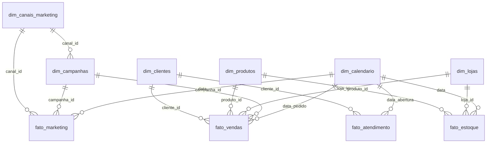

# 📖 Dicionário de Dados — Grão Nobre

> Documentação completa de todas as tabelas, colunas, tipos e relacionamentos.

---

## Tabelas Dimensão

### dim_clientes

Cadastro de todos os clientes da Grão Nobre.

| Coluna | Tipo | PK | FK | Nullable | Descrição | Exemplo |
|--------|------|----|----|----------|-----------|---------|
| `cliente_id` | VARCHAR(6) | ✅ | | ❌ | Identificador único do cliente | `CLI001` |
| `nome` | VARCHAR(100) | | | ❌ | Nome completo | `Lucas Silveira` |
| `email` | VARCHAR(150) | | | ❌ | Email (único) | `lucas@email.com` |
| `telefone` | VARCHAR(15) | | | ✅ | Telefone com DDD | `41999887766` |
| `cidade` | VARCHAR(50) | | | ❌ | Cidade de residência | `Curitiba` |
| `estado` | CHAR(2) | | | ❌ | UF (sigla) | `PR` |
| `regiao` | VARCHAR(20) | | | ❌ | Região do Brasil | `Sul` |
| `data_cadastro` | DATE | | | ❌ | Data do primeiro cadastro | `2025-01-15` |
| `faixa_etaria` | VARCHAR(10) | | | ❌ | Faixa etária agrupada | `25-30` |
| `genero` | CHAR(1) | | | ✅ | M, F ou N | `F` |
| `canal_aquisicao` | VARCHAR(30) | | | ❌ | Como o cliente chegou | `Google Ads` |
| `segmento_valor` | VARCHAR(15) | | | ❌ | Bronze/Prata/Ouro/Diamante | `Prata` |
| `status_churn` | VARCHAR(15) | | | ❌ | Ativo/Em risco/Inativo/Churned | `Ativo` |
| `aceita_marketing` | BOOLEAN | | | ❌ | Opt-in para comunicações | `true` |

---

### dim_produtos

Catálogo completo de produtos.

| Coluna | Tipo | PK | FK | Nullable | Descrição | Exemplo |
|--------|------|----|----|----------|-----------|---------|
| `produto_id` | VARCHAR(5) | ✅ | | ❌ | Identificador do produto | `PRD01` |
| `nome_produto` | VARCHAR(100) | | | ❌ | Nome completo | `Café Arábica Especial...` |
| `categoria` | VARCHAR(30) | | | ❌ | Categoria do produto | `Café em Grãos` |
| `subcategoria` | VARCHAR(30) | | | ✅ | Subcategoria | `Origem Única` |
| `preco_venda` | DECIMAL(10,2) | | | ❌ | Preço de venda (R$) | `45.00` |
| `custo_unitario` | DECIMAL(10,2) | | | ❌ | Custo unitário (R$) | `18.00` |
| `margem_percentual` | DECIMAL(5,2) | | | ❌ | (preco - custo) / preco × 100 | `60.00` |
| `peso_g` | INTEGER | | | ✅ | Peso em gramas | `250` |
| `ativo` | BOOLEAN | | | ❌ | Se o produto está ativo | `true` |
| `data_lancamento` | DATE | | | ❌ | Data de início de venda | `2025-01-15` |
| `pontuacao_scaa` | DECIMAL(4,2) | | | ✅ | Score SCAA (cafés) 80-100 | `87.50` |

---

### dim_canais_marketing

Canais de aquisição e marketing.

| Coluna | Tipo | PK | FK | Nullable | Descrição | Exemplo |
|--------|------|----|----|----------|-----------|---------|
| `canal_id` | VARCHAR(5) | ✅ | | ❌ | Identificador do canal | `CAN01` |
| `canal_nome` | VARCHAR(30) | | | ❌ | Nome do canal | `Google Ads (Search)` |
| `canal_grupo` | VARCHAR(20) | | | ❌ | Agrupamento | `Paid Search` |
| `canal_tipo` | VARCHAR(10) | | | ❌ | Pago ou Orgânico | `Pago` |
| `plataforma` | VARCHAR(20) | | | ❌ | Plataforma base | `Google` |
| `budget_mensal` | DECIMAL(10,2) | | | ❌ | Budget planejado | `6000.00` |
| `cpa_alvo` | DECIMAL(10,2) | | | ❌ | CPA meta | `35.00` |
| `roas_alvo` | DECIMAL(4,2) | | | ❌ | ROAS meta | `4.00` |

---

### dim_campanhas

Campanhas de marketing.

| Coluna | Tipo | PK | FK | Nullable | Descrição | Exemplo |
|--------|------|----|----|----------|-----------|---------|
| `campanha_id` | VARCHAR(6) | ✅ | | ❌ | Identificador da campanha | `CAM001` |
| `nome_campanha` | VARCHAR(100) | | | ❌ | Nome descritivo | `Black Friday 2026` |
| `canal_id` | VARCHAR(5) | | ✅ | ❌ | FK → dim_canais_marketing | `CAN01` |
| `tipo_campanha` | VARCHAR(20) | | | ❌ | Sazonal/Flash/Lançamento/etc | `Sazonal` |
| `data_inicio` | DATE | | | ❌ | Início da campanha | `2026-11-20` |
| `data_fim` | DATE | | | ❌ | Fim da campanha | `2026-11-30` |
| `budget_campanha` | DECIMAL(10,2) | | | ❌ | Budget total da campanha | `5000.00` |
| `desconto_percentual` | DECIMAL(5,2) | | | ✅ | Desconto oferecido (%) | `20.00` |
| `status` | VARCHAR(10) | | | ❌ | Planejada/Ativa/Finalizada | `Ativa` |

---

### dim_lojas

Lojas físicas e e-commerce.

| Coluna | Tipo | PK | FK | Nullable | Descrição | Exemplo |
|--------|------|----|----|----------|-----------|---------|
| `loja_id` | VARCHAR(5) | ✅ | | ❌ | Identificador da loja | `LOJ01` |
| `nome_loja` | VARCHAR(50) | | | ❌ | Nome comercial | `Grão Nobre — Batel` |
| `tipo` | VARCHAR(15) | | | ❌ | Física ou E-commerce | `Física` |
| `cidade` | VARCHAR(50) | | | ❌ | Cidade | `Curitiba` |
| `estado` | CHAR(2) | | | ❌ | UF | `PR` |
| `data_abertura` | DATE | | | ❌ | Data de inauguração | `2025-01-15` |
| `capacidade_lugares` | INTEGER | | | ✅ | Capacidade (lojas físicas) | `40` |
| `ativa` | BOOLEAN | | | ❌ | Se está em operação | `true` |

---

### dim_calendario

Tabela calendário (gerada automaticamente).

| Coluna | Tipo | PK | FK | Nullable | Descrição | Exemplo |
|--------|------|----|----|----------|-----------|---------|
| `data` | DATE | ✅ | | ❌ | Data (chave) | `2026-01-15` |
| `ano` | INTEGER | | | ❌ | Ano | `2026` |
| `mes` | INTEGER | | | ❌ | Mês (1-12) | `1` |
| `dia` | INTEGER | | | ❌ | Dia do mês | `15` |
| `trimestre` | INTEGER | | | ❌ | Trimestre (1-4) | `1` |
| `semestre` | INTEGER | | | ❌ | Semestre (1-2) | `1` |
| `nome_mes` | VARCHAR(15) | | | ❌ | Nome do mês em PT-BR | `Janeiro` |
| `nome_dia_semana` | VARCHAR(15) | | | ❌ | Nome do dia | `Quinta-feira` |
| `dia_semana_num` | INTEGER | | | ❌ | Dia da semana (1=Seg) | `4` |
| `semana_ano` | INTEGER | | | ❌ | Semana do ano (ISO) | `3` |
| `is_fim_semana` | BOOLEAN | | | ❌ | Sábado ou Domingo | `false` |
| `is_feriado` | BOOLEAN | | | ❌ | Feriado nacional | `false` |
| `nome_feriado` | VARCHAR(50) | | | ✅ | Nome do feriado | `Carnaval` |
| `sazonalidade` | VARCHAR(20) | | | ❌ | Alta/Média/Baixa | `Baixa` |

---

## Tabelas Fato

### fato_vendas

Grain: **Uma linha por item de pedido.**

| Coluna | Tipo | PK | FK | Nullable | Descrição | Exemplo |
|--------|------|----|----|----------|-----------|---------|
| `venda_id` | VARCHAR(8) | ✅ | | ❌ | ID único do item de venda | `VEN00001` |
| `pedido_id` | VARCHAR(7) | | | ❌ | ID do pedido (agrupa itens) | `PED1001` |
| `data_pedido` | DATE | | ✅ | ❌ | FK → dim_calendario | `2026-01-10` |
| `cliente_id` | VARCHAR(6) | | ✅ | ❌ | FK → dim_clientes | `CLI001` |
| `produto_id` | VARCHAR(5) | | ✅ | ❌ | FK → dim_produtos | `PRD01` |
| `loja_id` | VARCHAR(5) | | ✅ | ❌ | FK → dim_lojas | `WEB01` |
| `campanha_id` | VARCHAR(6) | | ✅ | ✅ | FK → dim_campanhas | `CAM001` |
| `canal_atribuicao` | VARCHAR(30) | | | ❌ | Canal do último clique | `Google Ads (Search)` |
| `quantidade` | INTEGER | | | ❌ | Qtd de unidades | `2` |
| `preco_unitario` | DECIMAL(10,2) | | | ❌ | Preço por unidade | `45.00` |
| `desconto_percentual` | DECIMAL(5,2) | | | ❌ | Desconto aplicado (%) | `5.00` |
| `valor_desconto` | DECIMAL(10,2) | | | ❌ | Valor do desconto (R$) | `4.50` |
| `valor_bruto` | DECIMAL(10,2) | | | ❌ | quantidade × preco_unitario | `90.00` |
| `valor_liquido` | DECIMAL(10,2) | | | ❌ | valor_bruto - valor_desconto | `85.50` |
| `custo_total` | DECIMAL(10,2) | | | ❌ | quantidade × custo_unitario | `36.00` |
| `lucro_bruto` | DECIMAL(10,2) | | | ❌ | valor_liquido - custo_total | `49.50` |
| `frete` | DECIMAL(10,2) | | | ❌ | Valor do frete | `15.90` |
| `meio_pagamento` | VARCHAR(20) | | | ❌ | PIX/Crédito/Débito/Boleto | `PIX` |
| `status_pedido` | VARCHAR(15) | | | ❌ | Status atual | `entregue` |
| `data_envio` | DATE | | | ✅ | Data de despacho | `2026-01-12` |
| `data_entrega` | DATE | | | ✅ | Data de entrega | `2026-01-16` |

**Métricas calculadas (Power BI / SQL):**
```
margem_percentual = lucro_bruto / valor_liquido × 100
dias_entrega = data_entrega - data_envio
receita_real = valor_liquido - (taxa_pagamento × valor_liquido)
```

---

### fato_marketing

Grain: **Uma linha por canal por dia.**

| Coluna | Tipo | PK | FK | Nullable | Descrição | Exemplo |
|--------|------|----|----|----------|-----------|---------|
| `marketing_id` | VARCHAR(8) | ✅ | | ❌ | ID único do registro | `MKT00001` |
| `data` | DATE | | ✅ | ❌ | FK → dim_calendario | `2026-01-01` |
| `canal_id` | VARCHAR(5) | | ✅ | ❌ | FK → dim_canais_marketing | `CAN01` |
| `campanha_id` | VARCHAR(6) | | ✅ | ✅ | FK → dim_campanhas | `CAM001` |
| `investimento_reais` | DECIMAL(10,2) | | | ❌ | Valor investido (R$) | `180.00` |
| `impressoes` | INTEGER | | | ❌ | Número de impressões | `8200` |
| `cliques` | INTEGER | | | ❌ | Número de cliques | `610` |
| `conversoes` | INTEGER | | | ❌ | Conversões atribuídas | `14` |
| `receita_atribuida` | DECIMAL(10,2) | | | ❌ | Receita das conversões | `1680.00` |
| `novos_leads` | INTEGER | | | ❌ | Leads gerados | `22` |
| `sessoes_site` | INTEGER | | | ❌ | Sessões no site | `580` |
| `bounce_rate` | DECIMAL(5,2) | | | ❌ | Taxa de rejeição (%) | `42.30` |

**Métricas calculadas:**
```
CPC = investimento_reais / cliques
CTR = (cliques / impressoes) × 100
CPM = (investimento_reais / impressoes) × 1000
CPA = investimento_reais / conversoes
ROAS = receita_atribuida / investimento_reais
taxa_conversao = (conversoes / cliques) × 100
```

---

### fato_atendimento

Grain: **Uma linha por ocorrência de atendimento.**

| Coluna | Tipo | PK | FK | Nullable | Descrição | Exemplo |
|--------|------|----|----|----------|-----------|---------|
| `atendimento_id` | VARCHAR(7) | ✅ | | ❌ | ID do atendimento | `ATD0001` |
| `data_abertura` | DATE | | ✅ | ❌ | FK → dim_calendario | `2026-02-10` |
| `cliente_id` | VARCHAR(6) | | ✅ | ❌ | FK → dim_clientes | `CLI003` |
| `pedido_id` | VARCHAR(7) | | | ✅ | Pedido relacionado | `PED1003` |
| `canal_atendimento` | VARCHAR(20) | | | ❌ | WhatsApp/Email/Chat/etc | `WhatsApp` |
| `tipo_ocorrencia` | VARCHAR(30) | | | ❌ | Tipo do ticket | `Atraso na entrega` |
| `prioridade` | VARCHAR(10) | | | ❌ | Alta/Média/Baixa | `Alta` |
| `status` | VARCHAR(15) | | | ❌ | Aberto/Em andamento/Resolvido | `Resolvido` |
| `tempo_resposta_min` | INTEGER | | | ❌ | Tempo até primeira resposta | `12` |
| `tempo_resolucao_min` | INTEGER | | | ✅ | Tempo até resolução | `180` |
| `nota_nps` | INTEGER | | | ✅ | Nota NPS (0-10) | `9` |
| `satisfacao` | VARCHAR(15) | | | ✅ | Satisfeito/Neutro/Insatisfeito | `Satisfeito` |

---

### fato_estoque

Grain: **Uma linha por produto por dia (snapshot diário).**

| Coluna | Tipo | PK | FK | Nullable | Descrição | Exemplo |
|--------|------|----|----|----------|-----------|---------|
| `estoque_id` | VARCHAR(8) | ✅ | | ❌ | ID único | `EST00001` |
| `data` | DATE | | ✅ | ❌ | FK → dim_calendario | `2026-01-01` |
| `produto_id` | VARCHAR(5) | | ✅ | ❌ | FK → dim_produtos | `PRD01` |
| `loja_id` | VARCHAR(5) | | ✅ | ❌ | FK → dim_lojas | `LOJ01` |
| `qtd_estoque` | INTEGER | | | ❌ | Quantidade em estoque | `150` |
| `qtd_vendida_dia` | INTEGER | | | ❌ | Vendas do dia | `8` |
| `qtd_recebida_dia` | INTEGER | | | ❌ | Recebimentos do dia | `0` |
| `is_ruptura` | BOOLEAN | | | ❌ | Estoque = 0 | `false` |
| `is_abaixo_minimo` | BOOLEAN | | | ❌ | Estoque < 20 | `false` |
| `dias_cobertura` | INTEGER | | | ❌ | Estoque / média vendas diária | `19` |

---

## Relacionamentos (ERD)



---

*Última atualização: 2026-10-02*
