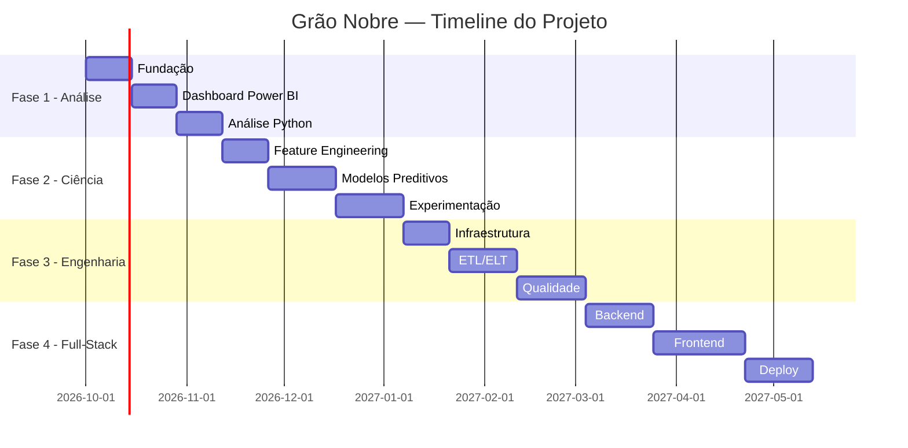

# 🗺️ Roadmap Detalhado — Grão Nobre Analytics Platform

> Plano de execução detalhado com tasks, entregáveis e critérios de conclusão.

---

## Fase 1 — Análise de Dados 📊
**Duração estimada:** 4-6 semanas  
**Status:** 🟡 Em andamento

### Sprint 1.1 — Fundação (Semana 1-2)

| # | Task | Prioridade | Status | Entregável |
|---|------|-----------|--------|------------|
| 1.1.1 | Definir regras de negócio | Alta | ✅ Done | `docs/BUSINESS_RULES.md` |
| 1.1.2 | Criar dicionário de dados | Alta | ✅ Done | `docs/DATA_DICTIONARY.md` |
| 1.1.3 | Criar arquitetura técnica | Alta | ✅ Done | `docs/ARCHITECTURE.md` |
| 1.1.4 | Criar repositório GitHub | Alta | ✅ Done | Repo público [Landoftha/grao-nobre-analytics](https://github.com/Landoftha/grao-nobre-analytics) |
| 1.1.5 | Configurar MCPs (GitHub + Linear) | Alta | ✅ Done | `mcp_config.json` configurado e testado |
| 1.1.6 | Criar projeto no Linear | Alta | ✅ Done | Board e 14 tasks criadas via API |
| 1.1.7 | Gerar dados sintéticos robustos | Alta | ✅ Done | CSVs em `data/raw/` (10 arquivos, 7218 vendas) |
| 1.1.8 | Criar script de validação de dados | Média | ✅ Done | `scripts/validate_data.py` (16.647 registros validados) |

### Sprint 1.2 — Dashboard Power BI (Semana 3-4)

| # | Task | Prioridade | Status | Entregável |
|---|------|-----------|--------|------------|
| 1.2.1 | Importar dados no Power BI | Alta | ✅ Done | 10 CSVs carregados no Power BI Desktop |
| 1.2.2 | Criar modelo dimensional no PBI | Alta | ✅ Done | Star Schema completo com relacionamentos 1:N |
| 1.2.3 | Criar medidas DAX | Alta | ✅ Done | Catálogo `powerbi/medidas_dax.md` |
| 1.2.4 | Dashboard — Visão Executiva | Alta | ⬜ Todo | Página 1 (Tasks YOH-19 a YOH-23 no Linear) |
| 1.2.5 | Dashboard — Vendas Detalhado | Alta | ⬜ Todo | Página 2 (Tasks YOH-24 a YOH-27 no Linear) |
| 1.2.6 | Dashboard — Marketing | Alta | ⬜ Todo | Página 3 (Tasks YOH-28 a YOH-32 no Linear) |
| 1.2.7 | Dashboard — Clientes | Média | ⬜ Todo | Página 4 (Tasks YOH-33 a YOH-36 no Linear) |
| 1.2.8 | Dashboard — Estoque | Média | ⬜ Todo | Página 5 |
| 1.2.9 | Dashboard — Atendimento | Média | ⬜ Todo | Página 6 |

### Sprint 1.3 — Análise com Python (Semana 5-6)

| # | Task | Prioridade | Status | Entregável |
|---|------|-----------|--------|------------|
| 1.3.1 | EDA de Vendas | Alta | ⬜ Todo | `notebooks/01_eda_vendas.ipynb` |
| 1.3.2 | EDA de Marketing | Alta | ⬜ Todo | `notebooks/02_eda_marketing.ipynb` |
| 1.3.3 | Análise de Coorte | Média | ⬜ Todo | `notebooks/03_cohort_analysis.ipynb` |
| 1.3.4 | Segmentação RFM | Média | ⬜ Todo | `notebooks/04_rfm_analysis.ipynb` |
| 1.3.5 | Relatório final da Fase 1 | Alta | ⬜ Todo | `docs/FASE1_REPORT.md` |

**Critério de conclusão da Fase 1:**
- [ ] Dashboard Power BI funcional com 6 páginas
- [ ] 4 notebooks de análise completos
- [ ] Dados com 2000+ registros de vendas, 500+ clientes
- [ ] Repositório GitHub com README e documentação

---

## Fase 2 — Ciência de Dados 🤖
**Duração estimada:** 6-8 semanas  
**Status:** ⬜ Não iniciado  
**Pré-requisito:** Fase 1 concluída

### Sprint 2.1 — Feature Engineering (Semana 1-2)

| # | Task | Prioridade | Entregável |
|---|------|-----------|------------|
| 2.1.1 | Feature store de clientes | Alta | `notebooks/05_feature_engineering.ipynb` |
| 2.1.2 | Variáveis RFM automatizadas | Alta | Script de features |
| 2.1.3 | Encoding e normalização | Média | Pipeline de preprocessamento |
| 2.1.4 | Análise de correlação | Média | Matriz de correlação |

### Sprint 2.2 — Modelos Preditivos (Semana 3-5)

| # | Task | Prioridade | Entregável |
|---|------|-----------|------------|
| 2.2.1 | Modelo de Previsão de Churn | Alta | `notebooks/06_churn_model.ipynb` |
| 2.2.2 | Previsão de Demanda (Prophet) | Alta | `notebooks/07_demand_forecast.ipynb` |
| 2.2.3 | Segmentação por Clustering | Média | `notebooks/08_clustering.ipynb` |
| 2.2.4 | Modelo de Atribuição (Markov) | Média | `notebooks/09_attribution.ipynb` |

### Sprint 2.3 — Experimentação e Deploy (Semana 6-8)

| # | Task | Prioridade | Entregável |
|---|------|-----------|------------|
| 2.3.1 | Framework de A/B Testing | Média | `notebooks/10_ab_testing.ipynb` |
| 2.3.2 | MLflow para experiment tracking | Média | Setup MLflow |
| 2.3.3 | Serialização de modelos | Alta | Modelos `.pkl` |
| 2.3.4 | Relatório final da Fase 2 | Alta | `docs/FASE2_REPORT.md` |

**Critério de conclusão da Fase 2:**
- [ ] 4 modelos treinados e avaliados
- [ ] Métricas de performance atingem metas
- [ ] Modelos serializados e versionados
- [ ] Notebooks documentados e reprodutíveis

---

## Fase 3 — Engenharia de Dados ⚙️
**Duração estimada:** 6-8 semanas  
**Status:** ⬜ Não iniciado  
**Pré-requisito:** Fase 2 concluída

### Sprint 3.1 — Infraestrutura (Semana 1-2)

| # | Task | Prioridade | Entregável |
|---|------|-----------|------------|
| 3.1.1 | Setup PostgreSQL (Docker) | Alta | `docker-compose.yml` |
| 3.1.2 | Criar schema do DW | Alta | `pipelines/sql/create_tables.sql` |
| 3.1.3 | Setup DuckDB para dev local | Média | Script de setup |
| 3.1.4 | Setup MinIO (Data Lake local) | Média | Container MinIO |

### Sprint 3.2 — ETL/ELT (Semana 3-5)

| # | Task | Prioridade | Entregável |
|---|------|-----------|------------|
| 3.2.1 | Setup Airflow (Docker) | Alta | DAGs |
| 3.2.2 | DAG: Ingestão CSV → Bronze | Alta | `dags/ingest_csv.py` |
| 3.2.3 | Setup dbt | Alta | `dbt_project.yml` |
| 3.2.4 | dbt models: Staging | Alta | `models/staging/` |
| 3.2.5 | dbt models: Intermediate | Alta | `models/intermediate/` |
| 3.2.6 | dbt models: Marts | Alta | `models/marts/` |

### Sprint 3.3 — Qualidade e Monitoramento (Semana 6-8)

| # | Task | Prioridade | Entregável |
|---|------|-----------|------------|
| 3.3.1 | Great Expectations | Média | Expectation suites |
| 3.3.2 | dbt tests | Alta | Tests YAML |
| 3.3.3 | Monitoramento de pipeline | Média | Alertas |
| 3.3.4 | Documentação dbt docs | Média | Site de docs |
| 3.3.5 | Relatório final da Fase 3 | Alta | `docs/FASE3_REPORT.md` |

**Critério de conclusão da Fase 3:**
- [ ] Pipeline end-to-end CSV → DW funcionando
- [ ] dbt models testados e documentados
- [ ] Data quality checks automatizados
- [ ] Power BI conectado ao PostgreSQL

---

## Fase 4 — Full-Stack Application 🌐
**Duração estimada:** 8-10 semanas  
**Status:** ⬜ Não iniciado  
**Pré-requisito:** Fase 3 concluída

### Sprint 4.1 — Backend (Semana 1-3)

| # | Task | Prioridade | Entregável |
|---|------|-----------|------------|
| 4.1.1 | Setup FastAPI | Alta | Projeto base |
| 4.1.2 | SQLAlchemy + Alembic | Alta | Models e migrations |
| 4.1.3 | Endpoints de vendas | Alta | API routes |
| 4.1.4 | Endpoints de marketing | Alta | API routes |
| 4.1.5 | Endpoints de clientes | Alta | API routes |
| 4.1.6 | Autenticação JWT | Alta | Auth middleware |
| 4.1.7 | Integração com modelos ML | Média | Endpoints de previsão |
| 4.1.8 | API docs (Swagger) | Média | Auto-gerado |

### Sprint 4.2 — Frontend (Semana 4-7)

| # | Task | Prioridade | Entregável |
|---|------|-----------|------------|
| 4.2.1 | Setup Next.js + TypeScript | Alta | Projeto base |
| 4.2.2 | Design System (tokens, cores) | Alta | CSS variables |
| 4.2.3 | Layout e navegação | Alta | Shell da app |
| 4.2.4 | Dashboard Executivo (web) | Alta | Página |
| 4.2.5 | Dashboard Vendas (web) | Alta | Página |
| 4.2.6 | Dashboard Marketing (web) | Alta | Página |
| 4.2.7 | Dashboard Clientes (web) | Média | Página |
| 4.2.8 | Login e auth flow | Alta | Páginas |

### Sprint 4.3 — Deploy e Polish (Semana 8-10)

| # | Task | Prioridade | Entregável |
|---|------|-----------|------------|
| 4.3.1 | Docker Compose completo | Alta | `docker-compose.yml` |
| 4.3.2 | CI/CD com GitHub Actions | Alta | Workflows |
| 4.3.3 | Deploy (Vercel + Railway) | Média | URL de produção |
| 4.3.4 | Testes E2E | Média | Playwright tests |
| 4.3.5 | README final do projeto | Alta | `README.md` |
| 4.3.6 | Relatório final da Fase 4 | Alta | `docs/FASE4_REPORT.md` |

**Critério de conclusão da Fase 4:**
- [ ] App web funcional com autenticação
- [ ] Dashboard web com 4+ páginas
- [ ] API documentada (Swagger)
- [ ] Deploys automatizados via CI/CD
- [ ] README de portfolio completo

---

## Timeline Visual

---

*Última atualização: 2026-10-02*
