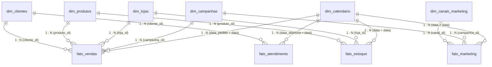

# 📊 Guia do Power BI — Grão Nobre Analytics

Este guia fornece o passo a passo completo para carregar os dados, configurar os relacionamentos do **Star Schema**, aplicar o tema visual e montar os dashboards analíticos no **Power BI Desktop**.

---

## 🎨 Passo 1: Aplicar o Tema de Cores da Grão Nobre

Para que o Power BI aplique automaticamente a identidade visual e as cores da cafeteria:

1. No Power BI Desktop, vá na aba superior **Exibição** (View).
2. Na galeria de temas, clique na setinha para baixo e selecione **Procurar temas** (Browse for themes).
3. Selecione o arquivo:
   ```text
   powerbi/grao_nobre_theme.json
   ```
4. As cores oficiais da marca serão aplicadas:
   * **Marrom Café Primário:** `#2D1810`
   * **Café com Leite Secundário:** `#C4956A`
   * **Dourado Acento:** `#E8B931`
   * **Sucesso / Lucro:** `#2ECC71`
   * **Alerta / Churn:** `#E74C3C`

---

## 📂 Passo 2: Importar os Dados

1. Na aba **Página Inicial** > clique em **Obter Dados** > **Texto/CSV**.
2. Navegue até a pasta `data/raw/` e importe os 10 arquivos CSV:
   * `dim_clientes.csv`
   * `dim_produtos.csv`
   * `dim_canais_marketing.csv`
   * `dim_campanhas.csv`
   * `dim_lojas.csv`
   * `dim_calendario.csv`
   * `fato_vendas.csv`
   * `fato_marketing.csv`
   * `fato_atendimento.csv`
   * `fato_estoque.csv`
3. Certifique-se de que a codificação seja **UTF-8** e o delimitador seja **Vírgula** (já configurados nos arquivos).
4. Clique em **Transformar Dados** (Power Query) para conferir os tipos (datas como `Data`, valores como `Número Decimal Fixo` ou `Decimal`) e depois em **Fechar e Aplicar**.

---

## 🔗 Passo 3: Configurar os Relacionamentos (Modelo Dimensional / Star Schema)

Vá na guia **Exibição de Modelo** (ícone de diagrama à esquerda) e organize as tabelas com as dimensões acima e os fatos abaixo. Configure as relações de `1 : N` (filtro único da dimensão para o fato):



> [!NOTE]
> Marque a tabela `dim_calendario` como tabela de data oficial:
> Clique com botão direito em `dim_calendario` > **Marcar como tabela de datas** > Selecione a coluna `data`.

---

## 🧮 Passo 4: Criar a Tabela `_Medidas` e Inserir os Cálculos DAX

1. Na aba **Página Inicial**, clique em **Inserir Dados**.
2. Defina o nome da tabela como `_Medidas` e clique em **Carregar**.
3. Abra o arquivo [`powerbi/medidas_dax.md`](./medidas_dax.md) e copie as fórmulas DAX pré-construídas:
   * **Vendas:** `Receita Bruta`, `Receita Líquida`, `Lucro Bruto`, `Margem Bruta %`, `Ticket Médio`, etc.
   * **Marketing:** `Investimento Total`, `ROAS`, `CAC`, `CTR %`, `CPC`, `CPA`, `Taxa de Conversão %`.
   * **Clientes:** `Total Base`, `Clientes Ativos`, `Taxa de Churn %`, `LTV Médio`, `LTV/CAC`.
   * **Atendimento:** `NPS Médio`, `Tempo Médio de Resposta`.

---

## 🖥️ Passo 5: Estrutura Sugerida das Páginas do Dashboard

### 📌 Página 1: Visão Executiva (C-Level)
* **Cartões (KPIs):** Receita Líquida, Margem Bruta %, Ticket Médio, ROAS Médio, Clientes Ativos.
* **Gráfico de Linhas:** Evolução Mensal da Receita Líquida vs Custo Total (com linha de tendência).
* **Gráfico de Barras Horizontais:** Top 5 Categorias mais lucrativas.
* **Gráfico de Rosca/Donut:** Receita por Canal de Venda (E-commerce vs Lojas Físicas).
* **Filtros (Slicers):** Ano/Mês, Região e Canal.

### 📌 Página 2: Vendas e Rentabilidade
* **Matriz:** Categoria > Subcategoria > Nome do Produto com Receita, Qtd Vendida, Lucro e Margem %.
* **Gráfico de Dispersão (Scatter Plot):** Preço de Venda vs Qtd Vendida (tamanho da bolha = Lucro).
* **Mapa:** Vendas por Estado/Região (destacando Sul e Sudeste).
* **Cartão com Métricas:** Total de Itens Vendidos e Valor Médio de Frete.

### 📌 Página 3: Marketing e Aquisição
* **Funil de Conversão:** Impressões ➔ Cliques ➔ Sessões ➔ Conversões.
* **Gráfico de Barras Agrupadas:** Investimento vs Receita Atribuída por Canal (Google, Meta, Orgânico, etc.).
* **Gráfico de Linhas com Dois Eixos:** ROAS vs Investimento diário.
* **Tabela/Matriz:** Performance das Campanhas (Black Friday, Dia das Mães, etc.) com CPA e Conversões.

### 📌 Página 4: Clientes e Retenção
* **Cartões de Segmentação:** Clientes Diamante, Ouro, Prata e Bronze.
* **Gráfico de Pizza:** Distribuição de Clientes por Status de Churn (Ativo, Em risco, Churned).
* **Gráfico de Colunas 100% Empilhadas:** Faixa Etária por Canal de Aquisição preferido.
* **KPIs Estratégicos:** LTV Médio e Relação LTV / CAC.
